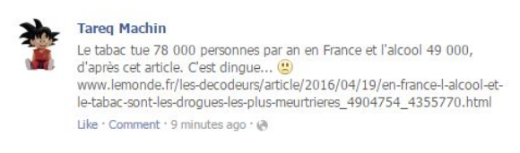

# Validation d'infos sur le Net

# Sources et informations

Une source peut être

  * primaire
  * secondaire
  * anonyme

Une information est

  1. d'intérêt public
  2. étayée par des faits
  3. vérifiée

### Exercices

<blockquote>Mon frère m’a raconté qu’il a vu un policier et un manifestant s’insulter jeudi dernier.</blockquote>

<blockquote>J’ai entendu dire d’un journaliste qui connaît très bien le sujet que Mme Truc sera
candidate à l’élection présidentielle.</blockquote>
Note: Pour chacune de ces informations, indiquez si elle provient d’une source  primaire ou secondaire

Note: exercice : Qui est l’auteur du message ? Vous semble-t-il être une source de confiance pour  parler de cette information ? Pourquoi ? Que feriez-vous pour essayer de vérifier cette information ?

## Vérifier la fiabilité d'un site

  * Les informations y sont-elles présentées comme des opinions ou comme des faits
  * Attention aux site de "réinformation"
  * Vérifier les sections *Contact*, *À propos* et *Mentions légales*
Note: Attention aux sites de "réinformation"

### Des outils utiles pour savoir "d'où on parle"

  * [Decodex](http://www.lemonde.fr/verification/)
  * [Whois](http://www.whois.com/)  
  * [Linkedin](https://linkedin.com)
  * [Societe.com](http://societe.com)
  * [Sirene.fr](http://sirene.fr)
  * [INSEE.fr](http://avis-situation-sirene.insee.fr/)

### Obtenir la "galaxie" d'un site

  les opérateurs avancés de Google : 
  * link:
  * site:
  * related:

### Exercices

Quelle est la galaxie du site
 * [medias-presse.info](http://www.medias-presse.info) ?
 * [ivg.net](https://www.ivg.net/)
 * [afterbaiz.com](https://afterbaiz.com)

## Infos sur l'auteur
Sur les réseaux sociaux, regarder avec attention :

  * La biographie
  * Les amis ou contacts
  * Les vidéos, posts, photos, commentaires ou statuts *aimés* ou publiés sur [Facebook](https://inteltechniques.com/osint/menu.facebook.html), Youtube ou [Twitter](https://inteltechniques.com/osint/menu.twitter.html)

### Pour aller plus loin

  * obtenir des infos sur un [profil](https://inteltechniques.com/osint/menu.user.html)
  * obtenir des infos sur une [personne](https://inteltechniques.com/osint/menu.name.html)
  * obtenir des infos à partir d'une [adresse email](https://inteltechniques.com/osint/menu.email.html)

### Exercice #1

Qui est l'animateur du site [Alter-info](http://www.alterinfo.net/) ?
note: une réserve de sites de "réinformation" à tester ici http://tempsreel.nouvelobs.com/rue89/rue89-internet/20160101.RUE7577/charlie-hebdo-qui-sont-ces-sites-qui-vous-parlent-de-complot.html

Qui est l'animateur du site [Mediaterannee.com](https://www.mediaterranee.com)
Note: cf article Arash Darembarsh https://www.mediaterranee.com/1112016-quand-les-inrocks-et-liberation-se-discreditent-sur-arash-derambarsh.html

## Croiser l'info

  * [Google News](https://news.google.com)
  * [search.creativecommons.org](http://search.creativecommons.org/)  
  * [TweetDeck](https://tweetdeck.twitter.com)  
  * Les [listes](https://twitter.com/afpfr/lists) Twitter
  * Les agrégateurs : [Feedly](https://feedly.com) <small>ReadKit, FeedDemon, Liferea</small>
  * Recherche avancée sur [Facebook](https://www.facebook.com/search/videos/?q=Patrice%20Evra) ou [Twitter](https://twitter.com/search-advanced?lang=fr)
  * [Youtube Geo Search](http://youtube.github.io/geo-search-tool/search.html)

### Exercice #1
 
Trouver et s'abonner à des listes permettant de cibler une recherche pour vérifier une info avec [Tweetdeck](https://tweetdeck.com)

### Exercice #2
Sur Twitter afficher tous les tweets récents sur les jeux olympiques, localisés en Seine Saint Denis et comportant une vidéo
Note: [Case study](http://verificationhandbook.com/book/chapter2.1.php)

### Exercice #3
Identifier l'auteur de [cette vidéo](https://www.youtube.com/watch?v=q1C2PW-U_WM) et s'assurer de sa fiabilité

# Images et vidéos

## Les méta données
Faites parler vos fichiers avec
  * Extension exif viewer dans [firefox](https://addons.mozilla.org/en-US/firefox/addon/exif-viewer/) ou [Chrome](https://chrome.google.com/webstore/detail/exif-viewer/nafpfdcmppffipmhcpkbplhkoiekndck)
  * [Jeffrey Image Metadata viewer](http://exif.regex.info/exif.cgi)

<small>Précision : YouTube & co effacent les méta données</small>

### Exercice
Lire les métadonnées de [cette image](i/img-full-of-data.jpg)

## Recherche inversée

Vérifier l'antériorité d'une image ou d'une vidéo avec
  * [TinEye](https://tineye.com)
  * [Google Image](https://images.google.com/)
  * [Citizen evidence](https://citizenevidence.amnestyusa.org/) pour les vidéos
  * [le Tout en un](https://inteltechniques.com/menu.html)

### Exercices

Fake ?

Fake ?

<small>Cette image a été publiée pour illustrer les victimes de la guerre entre l'Ukraine et la Russie.</small>

Cette [information](http://www.dailymail.co.uk/news/article-3310486/Shocking-footage-shows-ISIS-militants-massacring-200-captive-Syrian-children-bloodthirsty-jihadis-latest-mass-execution.html) et la vidéo qui l'accompagne sont elles authentiques ?
Note: In this case it would have been simply a matter of Googling “ISIS kills 200” 

Fake ?

## Vérifier le contexte

<small>Parfois de simples détails suffisent</small>

### Iran, décembre 2009

Note: La scène était présentée comme se déroulant en Iran, en décembre 2009. Cette photo est intéressante car elle offre plusieurs détails permettant de la vérifier. Les boucliers de la police iranienne sont-ils de cette couleur ? Les trottoirs de Téhéran peints en jaune ? Les jeunes Iraniens habillés de cette façon ? Quel temps fait-il en Iran en déembre ?

  * [wunderground.com](https://www.wunderground.com/history/) : obtenir l'historique de la météo dans un lieu précis

### Des réfugiés à Erfurt, Allemagne
D’après la légende sur YouTube, cette [vidéo](https://www.YouTube.com/watch?time_continue=43&v=rPMgw_Xcdzw) montrerait un groupe de réfugiés attaquer une voiture de police à Erfurt, une ville du centre de l’Allemagne. Deux détails pouvaient néanmoins faire tiquer. 
Note: D’abord, on entend les assaillants crier en allemand, ce qui peut sembler étonnant pour des migrants syriens ou afghans fraîchement débarqués. Ensuite, une recherche rapide sur Google permet de retrouver les modèles de camions dont dispose la police d’Erfurt. 

### Trouver le lieu de prise de vue

  * [Google Maps](https://www.google.fr/maps/)

Cette photo est-elle vraiment une photo de l'arrestation du poseur de bombe Ahmad Rahami à Linden dans le New-Jersey ?
Note: [Google Street et Google Maps](https://www.google.fr/maps/@40.6345425,-74.2483321,3a,75y,90h,80.37t/data=!3m6!1e1!3m4!1sLOIvE2JkP-1xicZLli5myg!2e0!7i13312!8i6656?hl=fr)

Note: If we search for a phone number with 8211 in it in Linden, NJ, we get a result for Fernando’s Auto Sales & Body Work, which completes the “-ARS” and “-ODY” fragments – cars and body. 

### L'affaire du MH17

http://obkon.ucoz.com/_fr/14/0162309.jpg
Note: Le vol de la malaisian airlines MH17 a été abattu au-dessus de l'Ukraine en juillet 2014. En novembre de la même année, une photo est publiée sur un forum laissant croire qu'un chasseur a abattu l'avion.. 1 logo 2. modèle avion 3. fond de carte google et yandex. [Les détails ici](https://www.bellingcat.com/news/2014/11/14/russian-state-television-shares-fake-images-of-mh17-being-attacked/)

## Utilisez votre instinct
Parfois la recherche inversée, les recherches sur l'auteur et les détails photo ne suffisent pas, il faut alors faire preuve de créativité. 

Dans cette [vidéo d'affrontements supposés](https://www.YouTube.com/watch?time_continue=1&v=Fhm1q_l2O5Y) entre soldats ukrainiens et forces séparatistes russes, quelques détails permettent de douter de l'autenhenticité de ce document.
Note: Pour trouver la vidéo originale, les contributeurs de BellingCat se sont mis dans la peau d’un créateur de fake news : If you search the Russian phrases for “training exercises” and “night,” this video would be the very first result. 

## A l'ancienne
Créez ou mobilisez votre réseau

Note: Fake image débunkée grâce aux internautes

## Ressources
  * Guides de FirstDraftNews de [vérification de photos](https://firstdraftnews.com/wp-content/uploads/2017/03/FDN_verificationguide_photos.pdf?x40896)
  * Guides de FirstDraftNews de [vérification de vidéos](https://firstdraftnews.com/wp-content/uploads/2017/03/FDN_verificationguide_videos.pdf?x40896)  
  * [Kit du decodex](http://www.lemonde.fr/les-decodeurs/article/2017/02/03/decodex-notre-kit-pour-verifier-l-information-a-destination-des-enseignants-et-des-autres_5074257_4355770.html)
  * [Advanced Guide on Verifying Video Content](https://www.bellingcat.com/resources/how-tos/2017/06/30/advanced-guide-verifying-video-content/) en anglais
  * La méthode des [observateurs de France 24](http://observers.france24.com/fr/20151106-comment-verifier-images-reseaux-sociaux)
  * [The verification handbook](http://verificationhandbook.com) en anglais

