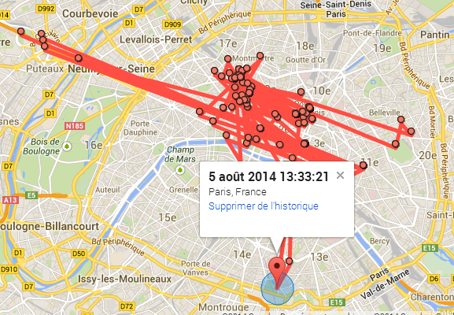

<section>

  <section data-markdown>
  Captation des données personnelles
  ==========
  </section>

  <section data-markdown>
  > Nous savons où vous vous trouvez. Nous savons où vous avez été. Nous pouvons plus ou moins savoir à quoi vous pensez
  </section>

  <section data-markdown>
  <cite title="author">Eric Schmidt président d'Alphabet, 2010</cite>
  </section>

  <section data-markdown>
  ## Des services hyper-centralisés

    * Google et Facebook possèdent 8 des 10 services les plus utilisés sur Internet
    * 70% du trafic Internet transite par Google et Facebook
    * 34% du commerce en ligne est contrôlé par Amazon

  Note: Facebook, Whatsapp, Gmail, Instagram, Google, Chrome, Youtube, Google Maps. Source: Society, ils ont cassé Internet.
  </section>

  <section data-markdown>
  # Le nouvel or noir

    * Jalousement gardées par les géants du web
    * Revendues à des [data brokers](http://www.zdnet.fr/actualites/data-brokers-aux-etats-unis-votre-vie-privee-est-en-vente-39789295.htm), Axciom, Bluekai
   
  Note: À titre d'information : Axciom a dégagé un revenu de 1,15 milliard de dollars en 2012
  </section>

  <section data-markdown>
  > Vous vous sentez peut-être protégé, mais le jour où vous devrez renouveler votre contrat d'assurance et que la compagnie vous dira "désolé, votre taux a doublé, c'est quoi tous ces burgers que vous commandez sur Deliveroo", vous vous sentirez affecté"
  <cite title="author">Aral Balkan</cite>
  </section>
</section>

<section>
  <section data-markdown>
  Démonstration
  ======
  Pour flipper un peu
  </section>

  <section data-markdown>
  Google
  ---
  </section>

<section data-markdown>
****

    https://www.google.com/maps/timeline
</section>

<section data-markdown>
Google conserve une liste de tous vos achats, y compris ceux que vous effectuez hors Google Store...

    https://myaccount.google.com/purchases

Note: Tous les achats dont on reçoit une confirmation par mail sont stockés ici, sans aucune demande de consentement particulière.
</section>

  <section data-markdown>
  Pour aller plus loin : [Want to freak yourself out?](https://threadreaderapp.com/thread/977559925680467968.html)
  </section>

  <section data-markdown>
  Facebook
  -----
  </section>

  <section data-markdown>
  ### Comment Facebook récupère des données ?

    * Les données que vous entrez vous-même (nom, prénom, âge, préférences sexuelles, etc.)
    * Ce que vous aimez ou partagez
    * Les données collectées par des applications tierces
    * Les données que vos amis rentrent sur Facebook
  </section>

  <section data-markdown>
  # Atelier pratique
  Récupérez sur Facebook vos [données personnelles](https://www.facebook.com/settings?tab=your_facebook_information) et analysez-les.
  </section>
</section>

<section>
  <section data-markdown>
  Quel régime pour les données personnelles
  =========================================
  </section>

  <section data-markdown>
  1. Crypto terrorisme
  --------------------
  </section>

  <section data-markdown>
  ### Une utilisation raisonnée de Facebook
  </section>

  <section data-markdown>
  [Selon une étude du <acronym title="Proceedings of the National Academy of Sciences">PNAS</acronym>](http://www.pnas.org/content/early/2015/01/07/1418680112), avec 10 *J'aime*, un algorithme s’est révélé plus doué pour déterminer la personnalité d’un volontaire qu’un collègue de travail.
  </section>

  <section data-markdown>
  ### Utiliser des outils qui bloquent les possibilités de collecte de données
  </section>

  <section data-markdown>
  <ul>
  <li class="fragment">Dans ce contexte, oubliez la navigation privée dans [firefox](https://support.mozilla.org/fr/kb/navigation-privee-naviguer-sans-conserver-infos-sites) ou [chrome](https://support.google.com/chrome/answer/95464?hl-fr) qui n'a en fait pas grand chose de privé...</li>
  <li class="fragment">[Disconnect](https://disconnect.me/), [Privacy Badger](https://www.eff.org/fr/privacybadger) ou [Noscript](https://noscript.net/). Oui mais...</li>
  <li class="fragment">[L'erreur est humaine](https://blog.barbayellow.com/2018/04/15/facebook-et-mes-donnees/). Et si ce n'est pas vous qui lâchez des informations, vos "amis" le feront pour vous.</li>
  </ul>
  </section>

  <section data-markdown>
  ### Ne pas avoir de compte Facebook
  </section>

  <section>
  	
  </section>

  <section data-markdown>
  ### En résumé

    * Une approche individuelle. Sauf que contre Google ou Facebook, **seul on perd à tous les coups**
    * Une approche **exclusivement tournée vers la protection de la vie privée**. Or les données personnelles ça sert aussi à faire de l'IA. On ne peut pas  abandonner ces prérogatives à des sociétés privées seules
  </section>

  <section data-markdown>
  Revente consentie
  ----------------- 
  </section>

  <section data-markdown>
  ### Et si on partageait le gâteau ?
  </section>

  <section data-markdown>
  Une idée lumineuse du Think Tank [Génération libre](https://www.generationlibre.eu/)
  </section>

  <section data-markdown>
  > Inspiré par le raisonnement déployé par le chercheur américain Jaron Lanier, l’objectif est de rendre l’individu juridiquement propriétaire de ses données personnelles. Chacun pourrait ainsi vendre ses données aux plateformes, ou au contraire payer pour le service rendu et conserver ses données privées.

  Source : https://www.generationlibre.eu/data-a-moi/
  </section>

  <section data-markdown>
    * Une approche individuelle. Sauf que contre Google ou Facebook, **seul on perd à tous les coups**
    * Un rapport de force déséquilibré
    * Une approche extrêmement libérale : c'est quand la dernière fois que tu as vendu un de tes reins pour te faire de l'argent de poche ?
    * Une approche illégale qui va à l'encontre de la loi de Informatiques et libertés de 78 et du <acronym title="Règlement Général pour la Protection des Données personnelles">RGPD</acronym>
  </section>

  <section data-markdown>
  > Les données personnelles ne peuvent être comparées à un prix et, ainsi, ne peuvent être considérées comme des marchandises.

  Source : [Directive du parlement européen novembre 2017](https://www.laquadrature.net/fr/contenu_num_pe)
  </section>

  <section data-markdown>
  Les données personnelles comme bien public
  ------------------------------------------
  </section>

  <section data-markdown>
  >   Les données sont un bien essentiel, infrastructurel, qui devrait nous appartenir à tous  (...) Au lieu de payer à Amazon un droit d’accès pour utiliser ses capacités en IA — élaborées à partir de nos données — nous devrions réclamer à Amazon de nous payer ce droit.

  Evgeny Morosov, [Data populists must seize our information – for the benefit of us all](https://www.theguardian.com/commentisfree/2016/dec/04/data-populists-must-seize-information-for-benefit-of-all-evgeny-morozov)
  </section>

  <section data-markdown>
  Les données personnelles comme des terrasses de café sur une place publique : **un usage privatif d'un bien public soumis à conditions**
  </section>

  <section data-markdown>
  ### Les données personnelles sous copyleft ou GPL

    * Les <acronym title="Google Apple Facebook Amazon Microsoft">Gafam</acronym> seraient obligées de mettre en place des API ouvertes permettant à des tiers d’utiliser les données sur lesquelles elles s’appuient.
    * L'exploitation de ces données serait soumise à condition, pour tous, y compris pour les <acronym title="Google Apple Facebook Amazon Microsoft">Gafam</acronym>
  </section>

  <section data-markdown>
  ### En résumé

    * Ne pas considérer les personnelles sous le seul aspect de la revente ou de la protection individuelle mais aussi et surtout de l'usage. 
    * Une articulation entre protection individuelle et usage collectif
  </section>

  <section data-markdown>
  > La vie privée a cessé d’être un droit individuel pour devenir une négociation collective.

  Antonio Casilli, [Quatre thèses sur surveillance de masse et vie privée](http://www.casilli.fr/2014/08/27/quatre-theses-sur-surveillance-de-masse-et-vie-privee/)
  </section>
</section>

<section data-markdown>
# Bibliographie 

[Evgeny Morozov et le « domaine public » des données personnelles](https://scinfolex.com/2017/10/29/evgeny-morozov-et-le-domaine-public-des-donnees-personnelles/) | [Quatre thèses sur surveillance de masse et vie privée](http://www.casilli.fr/2014/08/27/quatre-theses-sur-surveillance-de-masse-et-vie-privee/) | [Faut pas prendre les usagers des GAFAM pour des Datas sauvages](http://affordance.typepad.com/mon_weblog/2018/01/faut-pas-prendre-les-usagers-des-gafa-pour-des-datas-sauvages-.html) | [Computer-based personality judgments are more accurate than those made by humans](http://www.pnas.org/content/early/2015/01/07/1418680112) | 
[Facebook: is it time we all deleted our accounts?](https://www.theguardian.com/technology/2018/mar/20/facebook-is-it-time-we-all-deleted-our-accounts) | [Don’t Fix Facebook. Replace It](https://www.nytimes.com/2018/04/03/opinion/facebook-fix-replace.html) | [Le miroir aux alouettes de la revente des données personnelles](https://scinfolex.com/2014/10/01/le-miroir-aux-alouettes-de-la-revente-des-donnees-personnelles/) | [Data populists must seize our information – for the benefit of us all](https://www.theguardian.com/commentisfree/2016/dec/04/data-populists-must-seize-information-for-benefit-of-all-evgeny-morozov) | [Revendre sse données personnelles, la fausse bonne idée](http://maisouvaleweb.fr/revendre-ses-donnees-personnelles-la-fausse-bonne-idee/)
</section>
