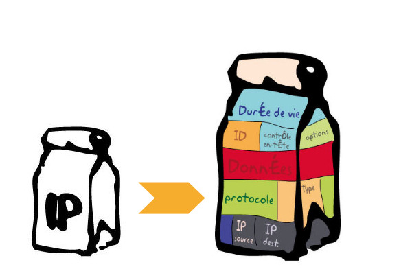
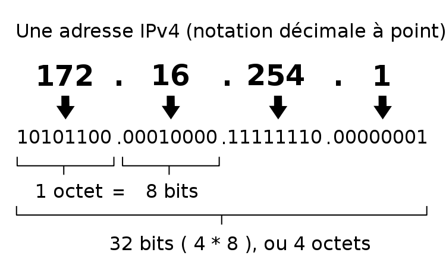
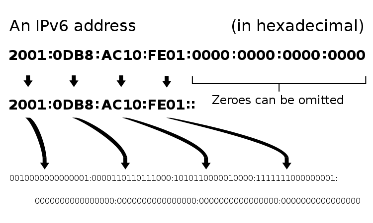
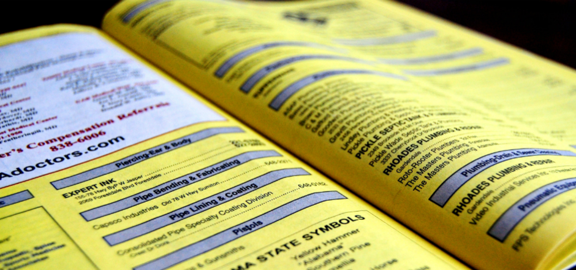
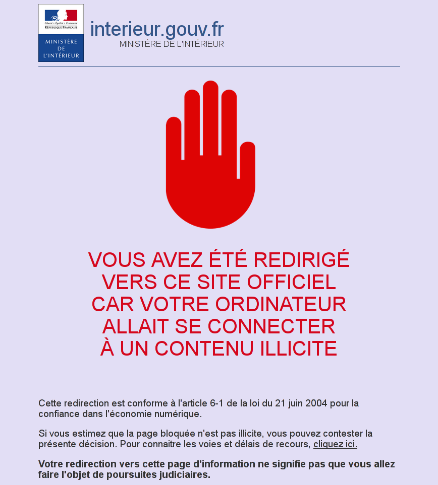

C'est quoi Internet&nbsp;? 
===============

Note: 1.Un peu d'histoire. 2. La structure 3. Les DNS et les blocages

  * Facebook
  * Twitter
  * Instagram... 
  * Mais pas que

Note: tout ça, c'est le web (http)

  * Mail 
  * Téléchargement de fichiers
  * VoIP
  * Chat
  * D'autres usages : DNS, BGP,  ssh, Telnet

Note: il existe d'autres usages et services que le www. À chaque usage correspond un protocole. Qu'est ce que'un protocole ? On le verra plus loin.

Dates clés
--------

  * 1969 : Arpanet
  * 1993 : Le world wide web

Arpanet 
-------

L'ancêtre d'Internet. Ce réseau cumule les deux caractéristiques qui ont fait le succès d'Internet :

  * **Dès sa création** : la commutation par "paquets" dans un réseau non centralisé
  * **1973** : la communication inter-réseaux

Note: Arpanet est créé par la Darpa, une agence de recherche technologique de  la Défense des États Unis. On reviendra sur les liens gvt / défense et technologies Internet. ARPANET n'a pourtant été conçu que pour faciliter les télécommunications entre chercheurs. Arpanet bénéficie à la fin des années 80 avec une maj matérielle qui le rend arpanet accessible à une plus large échelle. Vinton Cert et Robert E. Kahn. D'autres initiatives ailleurs, en Europe notamment avec Cyclades et Louis Pouzin. 

Le Web
------

Parmi tous les services et disponibles sur Internet, le Web est celui qui a fait exploser le nombre d'utilisateurs d'Internet

### 1989
Tim Berners Lee, chercheur au [CERN](https://home.cern/fr), propose de développer un système hypertexte organisé en toile (**Web**), afin d’améliorer la diffusion des informations internes. En gros il invente [les liens](https://fr.wikipedia.org/wiki/Hyperlien).

### 1993

Le CERN renonce aux droits d'auteur sur le  World Wide Web. L'utilisation du web explose.

Note: un mot sur les logiciels libres.

Comment ça marche
============

Commutation par circuit
--------
Réseau téléphonique, ferroviaire, electricité

Commutation par paquet
---------------------
Internet

Note: c'est ça Internet. La différence avec le Minitel. Un service par minitel. Contrairement aux sites web : de multiples sites consultés en même temps. Internet ne fait que router des paquets d'informations. C'est cette archi en paquet qui a fait exploser internet : machines relais bp moins cher à fabriquer.

Paquet
-------------

  * Un paquet est un ensemble de données
  * Ils sont transportés sur Internet par des machines appelées "routeurs"
  * Les routeurs ne connaissent que l'expéditeur et le destinataire et certainement pas ce que contiennent les paquets. Internet est un réseau "sans intelligence". Celle-ci est déportée sur ses extréméités, les clients et serveurs.

Note: Pas de câble entre chez toi et Youtube. Forcément il y a des relais.

Adresses IP
-----
Un paquet, tout comme un courrier postal, a besoin pour arriver à bon port d'une adresse expéditrice et d'une adresse destinatrice. Ce sont les **adresses IP**.

exemple de route : `182.56.12.54 vers 217.114.203.171`

Noms de domaine et IP
----------

Les humains et les machines ne parlent pas le même langage&nbsp;: *217.114.203.171* n'est pas le type d'adresse qu'on table dans un navigateur. Nous c'est plutôt *www.cfj.com*. 

Domain Name Server (DNS)
----------

Blocages et censure
------------

Note: Techniquement. Juridiquement : [loi terroriste de 2014](http://www.zdnet.fr/actualites/blocage-des-sites-le-decret-d-application-entre-en-vigueur-39814310.htm)

Contourner les blocages
-------------

  * En changeant de [serveur DNS](http://forums.cnetfrance.fr/topic/158796-comment-changer-ses-dns-manuellement-windows-mac-ios-android/)
  * En passant par des tunnels [VPN](https://nothing2hide.org/wiki/doku.php?id=protectionnumerique:vpn)
  * En utilisant le [navigateur Tor](http://torproject.org)

On reste en contact
==============

  * <a href="https://nothing2hide.org">https://nothing2hide.org</a>
  * contact at nothing2hide.org // GPG ID: 58519BC4
  * Twitter : @n0thing2hide
	* Facebook : Non
